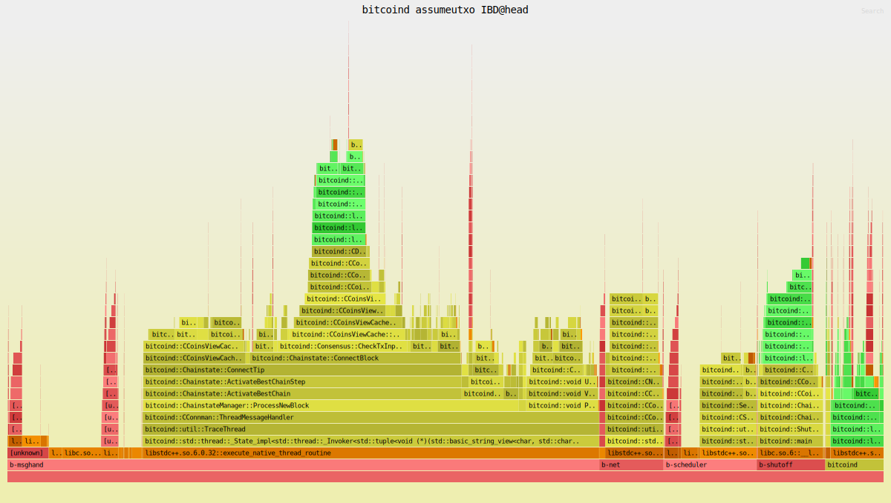

# benchcoin

A Bitcoin Core benchmarking fork

This repository is a fork of Bitcoin Core that performs automated assumeutxo-based IBD benchmarking.
It allows you to measure and compare the performance impact of certain types of changes to Bitcoin Core's codebase on a longer-running IBD benchmark, in a (pretty) reproducible fashion.

## Features

- Automated IBD benchmarking on pull requests
- Multiple configurations:
  - Signet (fast fail test)
  - Mainnet with default cache
  - Mainnet with large cache
- Performance visualizations including:
  - Flamegraphs for CPU profiling
  - Time series plots of various metrics
  - Compare `base` (bitcoin/bitcoin:master) and `head` (PR)

## Example Flamegraph

Below is an example flamegraph showing CPU utilization during IBD:



## How to use it

1. Open a Pull Request against **this repo**
2. Wait for the bot to comment on your PR after it's finished.

## How it works

When you open a pull request against this repository:

1. The CI workflow automatically builds both the base and PR versions of bitcoind
2. Runs IBD benchmarks using assumeutxo snapshots
3. Records performance metrics and creates various visualizations
4. Posts results as a comment on your PR

The benchmarks test three configurations:
- Signet
  - From snapshot @ height 160,000 to height 220,000
- Mainnet-default: with default (450 MB) dbcache
  - From snapshot @ height 840,000 to height 855,000
- Mainnet-large: with 32000 MB dbcache
  - From snapshot @ height 840,000 to height 855,000

## Benchmark Outputs

For each benchmark run, you'll get a github pages page with:

- Timing comparisons between base and PR versions
- CPU flamegraphs showing where time is spent
- Time series plots showing:
  - Block height vs time
  - Cache size vs block height
  - Cache size vs time
  - Transaction count vs block height
  - Coins cache size vs time
  - LevelDB metrics
  - Memory pool metrics

## Local Development

To run benchmarks locally (WIP, and Linux-only due to [shell.nix](shell.nix) limitations):

1. Make sure you have [Nix package manager](https://nixos.org/download/) installed

2. Setup the Nix development environment:
```bash
nix-shell
```

3. Run a local benchmark:
```bash
just run-signet
```

This will:
- Create a temporary directory for testing
- Build both base and PR versions
- Download the required UTXO snapshot if needed
- Run the benchmark
- Generate performance visualizations

## Technical Details

The benchmarking system uses:
- [Hyperfine](https://github.com/sharkdp/hyperfine) for benchmark timing
- [Flamegraph](https://github.com/willcl-ark/flamegraph) for CPU profiling
- [matplotlib](https://matplotlib.org/) for metric visualization
- [GitHub Actions](https://github.com/features/actions) for CI automation

The system leverages assumeutxo to speed up IBD (to a more interesting height) by loading a snapshot.

We use a custom assumeutxo patch which does introduces two commandline options for assumeutxo, specifically for
benchmarking. these commands are:

```
-pausebackgroundsync     - pauses background verification of historical blocks in the background.
-loadutxosnapshot=<path> - load an assumeutxo snapshot on startup, instead of needing to go through the rpc command.
                           The node will shutdown immediately after the snapshot has been loaded.
```

### Runner & seed

The CI runner is self-hosted on a Hetzner AX52 running at the bitcoin-dev-tools organsation level.
It is running NixOS using configuration found in this repo: [nix-github-runner](https://github.com/bitcoin-dev-tools/nix-github-runner) for easier deployment and reproducibility.

The runner host has 16 cores, with one used for system, one for `flamegraph` (i.e. `perf record`) and 14 dedicated to the Bitcoin Core node under test.

The benchmarking peer on the runner is served blocks over the (real) "internet" (it may be LAN as it's within a single Hetzner region) via a single peer to exercise full IBD codepaths. This naturally may introduce some variance, but it was deemed preferable to running another bitcoin core on the same machine.

This seed peer is another Hetzner VPS in the same region, and its configuration can be found here: [nix-seed-node](https://github.com/bitcoin-dev-tools/nix-seed-node)

## Contributing

1. Fork this repository (or bitcoin/bitcoin and add this as a remote)
2. Make your changes to Bitcoin Core
3. Open a pull request **against this repo. NOT bitcoin/bitcoin**
4. Wait for benchmark results to be posted on your PR here

## License

This project is licensed under the same terms as Bitcoin Core - see the [COPYING](COPYING) file for details.
