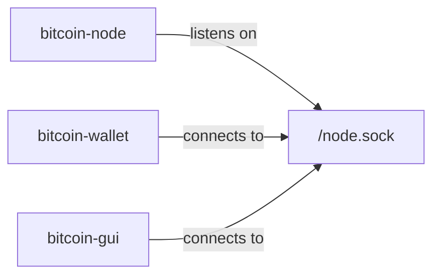
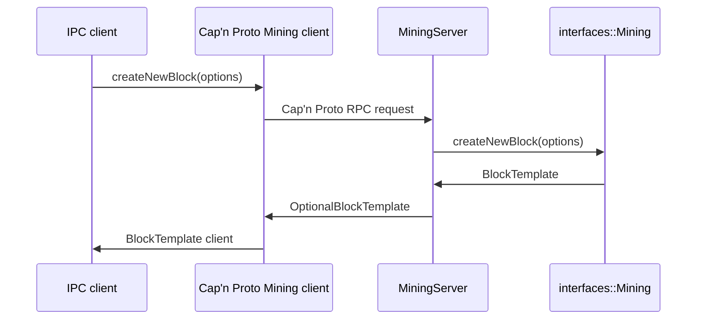

# Multiprocess Bitcoin Design Document

This document describes the design and architecture of the Bitcoin Core
multiprocess feature. For usage information, see the top-level
[multiprocess.md](../multiprocess.md) file.

## Introduction

Bitcoin Core has historically used a monolithic architecture. `bitcoind`
combines a P2P node, JSON-RPC server, indexes, and wallet support, while
`bitcoin-qt` adds a GUI to the same process. Multiprocess support separates
these components into smaller executables that communicate over local IPC
sockets.

The goal is to improve isolation and operational flexibility while keeping the
same local interfaces available to code that runs in a single process.

## Architecture

The multiprocess design uses specialized executables:

- `bitcoin-node`: P2P node, indexes, and JSON-RPC server.
- `bitcoin-wallet`: wallet functionality.
- `bitcoin-gui`: Qt GUI.

The current build also provides a `bitcoin` wrapper command. When invoked with
`-m`, the wrapper starts the multiprocess executable matching the requested
mode.

This subdivision can be extended. Indexes could move out of `bitcoin-node`, or
wallet and index processes could expose their own JSON-RPC servers instead of
forwarding through the node process.

## IPC Components

### Local Interfaces

Abstract C++ interfaces in [`src/interfaces/`](../../src/interfaces/) define
local process boundaries. Node, wallet, GUI, and test code use these interfaces
when components live in the same process.

The IPC implementation adapts selected local interfaces to Cap'n Proto
interfaces, but remote IPC objects are represented as Cap'n Proto clients on
the wire. Local `interfaces::*` implementations are not the wire protocol.

### Cap'n Proto Schemas

Schemas in [`src/ipc/capnp/`](../../src/ipc/capnp/) define the IPC wire
protocol. They are normal Cap'n Proto schemas and are compiled with the native
Cap'n Proto C++ generator.

The generated `*.capnp.h` and `*.capnp.c++` files provide the request builders,
response readers, clients, and server base classes used by the handwritten IPC
code.

### Native Protocol Code

Cap'n Proto-specific IPC code lives in
[`src/ipc/capnp/`](../../src/ipc/capnp/). It owns:

- connection setup and lifetime
- Cap'n Proto RPC systems and event-loop state
- handwritten server adapters
- temporary narrow client adapters where existing callers still expect a local
  interface object
- explicit Bitcoin type conversion helpers
- server-side execution queues for blocking work

Protocol-agnostic code in [`src/ipc/`](../../src/ipc/) handles process
spawning, socket setup, and protocol selection.

### Server Adapters

Server adapters inherit from generated Cap'n Proto server classes and call the
corresponding local Bitcoin interfaces. They explicitly read request
parameters, convert them to Bitcoin types, invoke local code, and populate
response builders.

Examples include:

- `InitServer`
- `EchoServer`
- `RpcServer`
- `MiningServer`
- `BlockTemplateServer`

This keeps IPC behavior readable in normal C++ instead of hiding it behind
generated local-interface wrappers.

### Type Conversion

Conversion helpers in [`src/ipc/capnp/conversions.*`](../../src/ipc/capnp/)
translate between Cap'n Proto values and Bitcoin types. They cover serialized
blocks and transactions, mining option structs, `BlockRef`, `CoinbaseTx`, and
`UniValue` JSON text.

Conversions are deliberately explicit and named so schema changes are easy to
review.

### Execution Policy

Cap'n Proto event-loop threads must not run blocking Bitcoin work directly.
Server connections use Bitcoin-owned worker queues for calls that can block,
wait, or perform substantial work.

Examples of queued calls include:

- `Rpc.executeRpc`
- `Mining.waitTipChanged`
- `Mining.createNewBlock`
- `Mining.checkBlock`
- `BlockTemplate.waitNext`
- `BlockTemplate.submitSolution`

Interrupt methods use a direct fast path so they can wake blocked worker calls:

- `Mining.interrupt`
- `BlockTemplate.interruptWait`

## Design Considerations

### Cap'n Proto

Cap'n Proto was selected because it supports RPC interfaces and object
references directly. This is useful for IPC capabilities such as mining block
templates, where a method can return an object that remains usable for later
requests.

### IPC Isolation

Most Bitcoin Core code should not need to know whether another component is
local or remote. IPC-specific code is kept under `src/ipc/`, while local
interface headers stay independent from Cap'n Proto.

### Interface Maintenance

Interface definitions are maintained in both C++ interface headers and Cap'n
Proto schemas. This duplication is a maintenance cost, but it keeps local
interfaces free of IPC-specific types and lets schema mismatches fail at build
time.

An alternate design could generate schemas from annotated C++ interfaces, but
that would require a portable C++ parser and more build-system complexity.

### Interface Stability

The IPC interfaces are currently internal and unstable. They can change without
backward compatibility while the multiprocess architecture is still evolving.
If these interfaces become external APIs later, Cap'n Proto's protocol
evolution rules can be used to support compatibility.

## Security Considerations

IPC support adds local sockets and Cap'n Proto RPC parsing to the attack
surface, so the feature remains optional. The design keeps IPC parsing and
connection management isolated in dedicated source directories and uses
explicit adapters at process boundaries.

Process separation can reduce the impact of some classes of bugs by placing
node, wallet, and GUI code in different address spaces. This does not remove
the need to validate all data crossing IPC boundaries.

## Example Flow

The following sequence shows a mining client requesting a block template from a
node process:

The returned `BlockTemplate` is a Cap'n Proto capability. Follow-up methods
such as `getBlock()`, `waitNext()`, and `submitSolution()` are requests on that
capability.

## Future Enhancements

Further improvements are possible:

- Separate indexes from `bitcoin-node`.
- Let wallet or index processes expose their own JSON-RPC servers.
- Generate schemas from C++ interface declarations.
- Stabilize selected IPC interfaces for external clients.
- Add sandboxing for subprocesses.
- Support IPC clients in other Cap'n Proto languages.

## References

- **Cap'n Proto RPC protocol description**: https://capnproto.org/rpc.html
